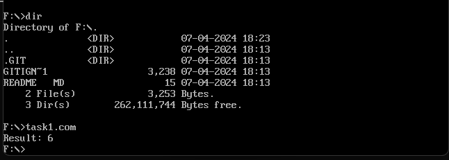

# Task 1
Згідно завдання та на основі асемблерного коду було проведено розрахунок арифметичного виразу

    ```
      b - c + a,
    ```
    
де   ` a = 3,  b = 5, c = 2 `, складає ` 5 - 2 + 3 = 6 `.
Результат розрахунків за допомогою середовища DOSBox наведено на рисунку. Як видно, результат розрахунку є правильним та відповідає визще наведеним обчисленням.




*Рисунок - Результат розрахунків за допомогою середовища DOSBox*
